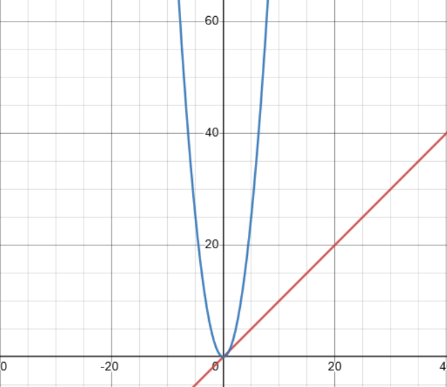
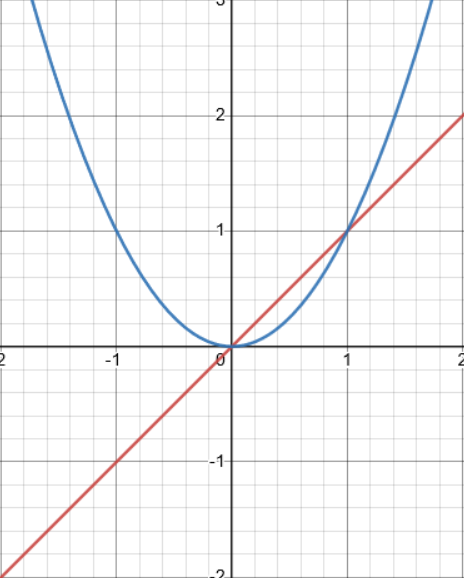

## Preliminary info
I'm going to assume you know some basic level of algebra to the point that you understand what functions. Here are some things you should know before jumping into this: 

iff - If and only if

Algorithm - Some set of steps utilized to solve a problem / task. In this post we'll model the work an algorithm does as a function known as "T(n)".

Limits - Limits are a concept that describes how functions inputs approach an output. Approach here means it describes the points that lead to the output, but not actually describing the output itself. Limits look like this:

$\lim_{x \to \infty}(x + 1)$

This describes how $x$ approaches $x + 1$.

Bounding functions - Bounding functions are functions that cover region above or below another graph. This "bounds" or "covers" the graph of the function. For example the function: $f(x) = x ^ 2$ is an upper bounding function to the function $g(x) = y$ because $f(x)$ grows faster than $g(x)$.

Asymptotic behavior -  Asymptotic behavior is the behavior of some function $f(x)$ as $x$ gets arbitrarily large. Asymptotic behavior is also known as tail behavior.

## What's asymptotic analysis?
Asymptotic analysis is the analysis of algorithm asymptotic behavior. We measure an algorithms asymptotic behavior by utilizing some different notations. The most popular notations computer scientists and programmers use are the: big O, theta, and omega notations. We asymptotically analyze two main areas of an algorithm, the time in which it takes to execute and how much memory it requires to run. These concepts are distinctly known as "time complexity" and "space complexity".

## Why does this matter to programmers?
Understanding how to use these notations and their differences is critical for programmers to know because it allows us to model how our algorithms handle performance when they scale. This is primarily useful for software engineers or systems engineers that deal with a large amount of data.

Heavy emphasis on the" **describes how algorithms scale**" part from our previous section, these notations do **NOT** describe how fast the algorithms are, it strictly describes how they grow given large inputs. Just because an algorithm has a faster or slower time complexity than another doesn't mean it's faster or slower, we'll get more into why in a second.

## Big O notation
Big O notation is the notation we utilize when we want to describe an upper bounding function to our work function (which is T(n)). We do this so we can approximate the worse case scenario of an algorithm. Let's formally define our big O function.

### Formal definition

$$
T(n) = O(f(n)) \text{ iff } T(n) <= k * f(n) \forall n >= n_0 \text{ as } x \to \infty
$$

"Read the upside down A as saying 'for all'"

### Definition explanation
*what even is that?* Lets go over it. It basically says $T(n)$ is upper bounded by $f(n)$ if and only if range of $f(n) * k$ is larger than or equal to the range of $T(n)$ after the $n_0th$ value as x approaches infinity. 

The reason we look at values after $n_0$ is because anything less than $n_0$ would be a negative number which wouldn't make sense in our analysis.

### Graph visualization
Let's visualize what upper bounding looks like. We'll define our T(n) to be an identity function $T(n) = n$.

There are **tons** of different functions we can choose from that we can try upper bounding our $T(n) function$. Some of these include:
* $f(n) = 1$
* $f(n) = n^2$
* $f(n) = n^3$
* $f(n) = log_2(n)$
* $f(n) = n!$

Some of these bounding functions have a name. For instance: 
* $f(n) = k$ - Constant time 
* $f(n) = n^2$ - Quadratic time
* $f(n) = n^3$ - Cubic time
* $f(n) = log_2(n)$ - Logarithmic time
* (you get the idea)

We'll choose $f(n) = n^2$ to try to upper bound our function:



There's no reason for us to define inputs and applying the formal definition, we can clearly see that the quadratic function ($f(n)$) upper bounds the linear time ($T(n)$) function. However, there's a really interesting thing we see when we zoom in further.



*Wait... I thought T(n) was supposed to be less than f(n)? What's happening?*
If we take a closer look at our definition, we remember that big O notation doesn't care about small inputs! 

### Conclusion
In summary, we utilize big O notation for describing the upper bounding behavior of an algorithm. This can be used to approximate but not precisely describe the worst case scenario for an algorithm.

## Big Omega notation
If you understood big O notation then this should come pretty easy to you, it's the same concept but we flip it and we look for lower bounding functions that graph below our original work. We typically associate the best case scenario with big omega.

### Formal definition

$$
T(n) = \Omega(f(n)) \text{ iff } T(n) >= k * f(n) \forall n >= n_0 \text{ as } x \to \infty
$$

No need for a visualization, we can infer what it would look like since it's the opposite case of big O.

## Theta notation
Theta notation basically combines both the big omega and big O notation together to create what's known as a "tight bound".

### Tight bound
A tight bound is an exact bound on how the function behaves asymptotically. We derive by finding some function that given some constant ($k$) that can provide both an upper and lower bound and if it can it's a "tight bounding" function.

### Conclusion
We typically associate the average case scenario with theta notation. It's worth noting that in most cases that we describe an algorithms time complexity, we typically mean to use theta over big O. The reason for this should be clear but big O doesn't describe exact bounds, it describes a set of functions that upper bound it. The reason this is a problem, is because we can say that a linear search like:

```c
int search(const char *str, const char c) {
    const size_t str_len = strlen(str);

    for(int i = 0; i < str_len; ++i) {
        if(str[i] == c) {
            return i;
        }
    }

    return -1;
}
```

could be: $O(n)$, $O(n^2)$, $O(n^3)$, you get the point. However, it's more informational to just say the tight bound which would be $\theta(n)$. Just remember, most of the time people mean $\theta$ but we don't typically have that on our keyboards :).

If you notice any grammatical issues or just wrong information please contact me through an issue submission on the github repository.
